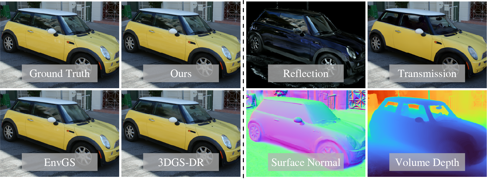

<div align="center">

# RT-Splatting: Joint Reflection-Transmission Modeling with Gaussian Splatting

[**Ji Shi**](https://github.com/sjj118) · [**Xianghua Ying**](https://scholar.google.com/citations?hl=zh-CN&user=27o9L1wAAAAJ) · [**Bowei Xing**](https://dblp.org/pid/320/5822.html)
<br>
[**Ruohao Guo**](https://ruohaoguo.github.io/) · [**Wenzhen Yue**](https://scholar.google.com/citations?hl=zh-CN&user=UPxl-gMAAAAJ)
<br>

CVPR 2026 (Highlight)
<br>

[]()
[](https://sjj118.github.io/RT-Splatting)
[](https://drive.google.com/drive/folders/1mmKcm1Fb5djX3B_PDKfC7XyfQ38_p5nl)
</div>

 
RT-Splatting is a hybrid surface-volume rendering framework that jointly models high-fidelity reflections and clear transmissions for semi-transparent scenes. It overcomes the blurry reflections and occluded backgrounds of existing methods, delivering state-of-the-art, real-time view synthesis. Beyond rendering, it perfectly decomposes the scene into independent reflection and transmission layers, unlocking powerful and intuitive material editing capabilities.

## Installation

```shell
conda create -n rtsplat python=3.10 -y
conda activate rtsplat
pip install -r requirements.txt

pip install --no-build-isolation submodules/simple-knn
pip install --no-build-isolation submodules/diff-surfel-anych

pip install --no-build-isolation git+https://github.com/NVlabs/nvdiffrast
```

## Datasets

We evaluate our method primarily on [Ref-Real](https://storage.googleapis.com/gresearch/refraw360/ref_real.zip), [NeRF-Casting](https://dorverbin.github.io/nerf-casting/), [EnvGS](https://drive.google.com/file/d/1FMtj2YvdbaQe8vxwZlULcSBuTWb4pI7I), [Tanks&Temples](https://repo-sam.inria.fr/fungraph/3d-gaussian-splatting/datasets/input/tandt_db.zip) and our self-captured scenes. Transparent masks and our self-captured scenes are available on [Google Drive](https://drive.google.com/drive/folders/1mmKcm1Fb5djX3B_PDKfC7XyfQ38_p5nl).

Put them under the `data` folder:

```
data/
├── rt-splatting/
│   ├── van/
│   │   ├── images/
│   │   ├── sparse/
│   │   └── transparent_masks/
│   └── swab/
├── nerf-casting/
├── ...
```

## Training & Evaluation

```shell
sh eval.sh
```

## Acknowledgements

This work is built on a number of inspiring research works:

- [2DGS: 2D Gaussian Splatting for Geometrically Accurate Radiance Fields](https://surfsplatting.github.io/)
- [Ref-GS : Directional Factorization for 2D Gaussian Splatting](https://ref-gs.github.io/)
- [EnvGS: Modeling View-Dependent Appearance with Environment Gaussian](https://zju3dv.github.io/envgs/)
- [NeRF-Casting: Improved View-Dependent Appearance with Consistent Reflections](https://dorverbin.github.io/nerf-casting/)
- [Ref-NeRF: Structured View-Dependent Appearance for Neural Radiance Fields](https://dorverbin.github.io/refnerf/)
- [SAM 2: Segment Anything in Images and Videos](https://ai.meta.com/sam2)

## Citation

If you find our work useful in your research, please cite:

```bibtex
@inproceedings{RT-Splatting,
  title={{RT-Splatting}: Joint Reflection-Transmission Modeling with Gaussian Splatting},
  author={Shi, Ji and Ying, Xianghua and Xing, Bowei and Guo, Ruohao and Yue, Wenzhen},
  booktitle={CVPR},
  year={2026},
}
```
